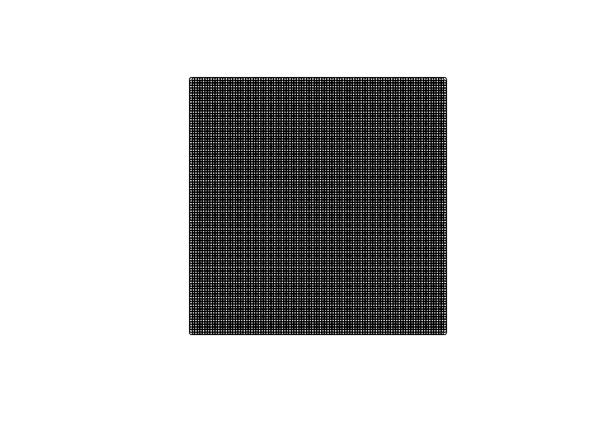
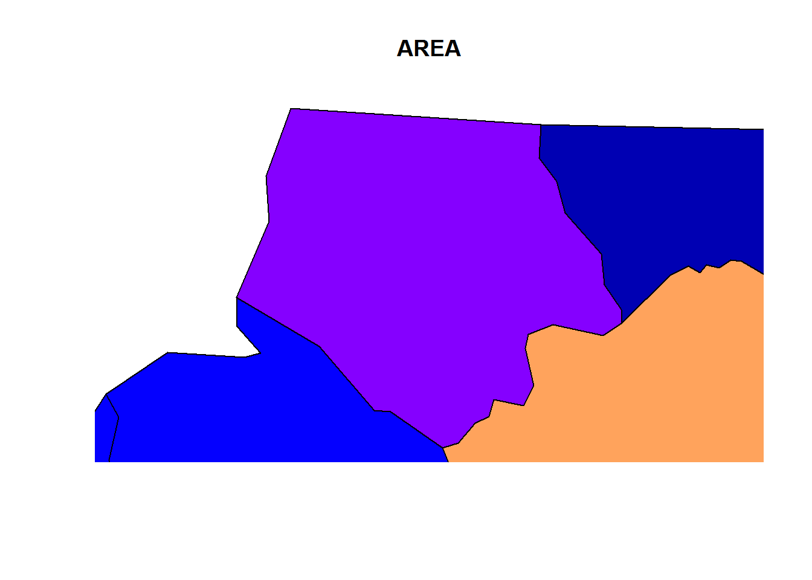
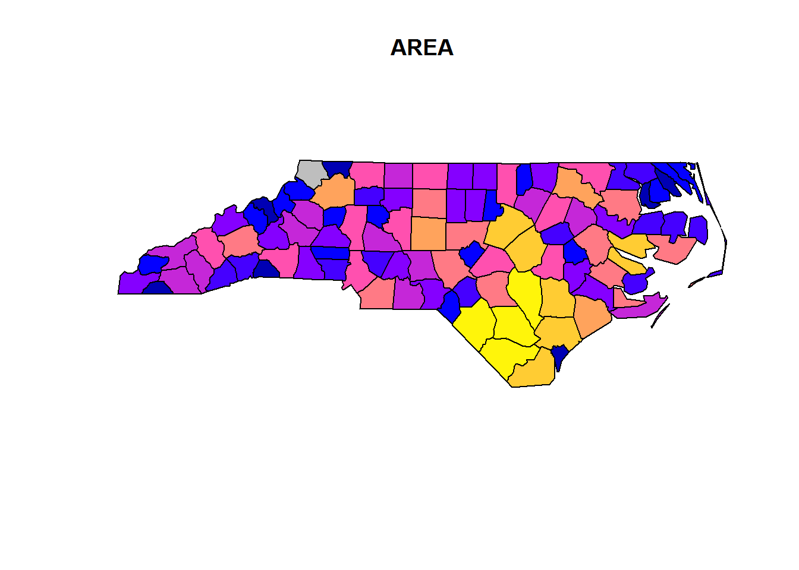

# Spatial data

## IO

1. **How to load/read and save/write spatial data?**


```r
library(sf)
## Linking to GEOS 3.5.1, GDAL 2.1.3, proj.4 4.9.2, lwgeom 2.3.2 r15302
nc <- st_read(system.file("shape/nc.shp", package="sf"), quiet = TRUE)
# st_write(nc, "nc.shp")
# see st_read_db() and st_write_db() for spatial databases
# look carefully through all of the arguments (especially layers,
# stringsAsFactors, geometry_column, type, quiet)
# in case of specific problems see:
# https://edzer.github.io/sfr/articles/sf2.html
#   ____________________________________________________________________________
```

## Objects

2. **What are the classes of sf-objects?**


```r
# the data.frame
class(nc)
#> [1] "sf"         "data.frame"

# the geometry list-column
class(st_geometry(nc))
#> [1] "sfc_MULTIPOLYGON" "sfc"

# the individual feature geometries
lapply(st_geometry(dplyr::slice(nc, 1:2)), class)
#> [[1]]
#> [1] "XY"           "MULTIPOLYGON" "sfg"         
#> 
#> [[2]]
#> [1] "XY"           "MULTIPOLYGON" "sfg"
```

3. **Which methods are avaliable for sf-objects**?


```r
methods(class = "sf")
#>  [1] $<-               [                 [[<-             
#>  [4] aggregate         anti_join         arrange_         
#>  [7] cbind             distinct_         filter_          
#> [10] full_join         group_by_         inner_join       
#> [13] left_join         merge             mutate_          
#> [16] plot              print             rbind            
#> [19] rename_           right_join        sample_frac      
#> [22] sample_n          select_           semi_join        
#> [25] slice_            st_agr            st_agr<-         
#> [28] st_as_sf          st_bbox           st_boundary      
#> [31] st_buffer         st_cast           st_centroid      
#> [34] st_convex_hull    st_coordinates    st_crs           
#> [37] st_crs<-          st_difference     st_geometry      
#> [40] st_geometry<-     st_intersection   st_is            
#> [43] st_line_merge     st_make_valid     st_polygonize    
#> [46] st_precision      st_segmentize     st_set_precision 
#> [49] st_simplify       st_sym_difference st_transform     
#> [52] st_triangulate    st_union          st_voronoi       
#> [55] st_zm             summarise_        transmute_       
#> see '?methods' for accessing help and source code

methods(class = 'sfc')
#>  [1] [                 c                 format           
#>  [4] print             st_as_binary      st_as_text       
#>  [7] st_bbox           st_boundary       st_buffer        
#> [10] st_cast           st_centroid       st_convex_hull   
#> [13] st_coordinates    st_crs            st_crs<-         
#> [16] st_difference     st_geometry       st_intersection  
#> [19] st_is             st_line_merge     st_make_valid    
#> [22] st_polygonize     st_precision      st_segmentize    
#> [25] st_set_precision  st_simplify       st_sym_difference
#> [28] st_transform      st_triangulate    st_union         
#> [31] st_voronoi        st_zm             str              
#> [34] summary           type_sum         
#> see '?methods' for accessing help and source code

methods(class = 'sfg')
#>  [1] as.matrix         c                 format           
#>  [4] head              plot              print            
#>  [7] st_as_binary      st_as_text        st_boundary      
#> [10] st_buffer         st_centroid       st_convex_hull   
#> [13] st_coordinates    st_difference     st_geometry      
#> [16] st_intersection   st_is             st_line_merge    
#> [19] st_make_valid     st_polygonize     st_segmentize    
#> [22] st_simplify       st_sym_difference st_transform     
#> [25] st_triangulate    st_union          st_voronoi       
#> [28] st_zm            
#> see '?methods' for accessing help and source code
```

4. **What sf-geometry types are available, how do you initialize them and what types are the internally?**


```r
# internal types:
# - point (atomic)
# - linestring (matrix)
# - everything else (list)

## common geometries
# point
st_point(c(1,2))
# linestring
st_linestring(rbind(c(0.2,3), c(0.2,4), c(1,4.8), c(2,4.8)))
# polygon
st_polygon(list(
  rbind(c(0,0), c(1,0), c(3,2), c(2,4), c(1,4), c(0,0)),
  rbind(c(1,1), c(1,2), c(2,2), c(1,1))))
# multipoint
st_multipoint(rbind(c(3.2,4), c(3,4.6), c(3.8,4.4), c(3.5,3.8), c(3.4,3.6)))
# multilinestring
st_multilinestring(list(rbind(c(0.2,3), c(0.2,4), c(1,4.8), c(2,4.8)),
                        rbind(c(0,4.4), c(0.6,5))))
# multipolygon
st_multipolygon(list(
  list(rbind(c(0,0), c(1,0), c(3,2), c(2,4), c(1,4), c(0,0)),
       rbind(c(1,1), c(1,2), c(2,2), c(1,1))),
  list(rbind(c(3,0), c(4,0), c(4,1), c(3,1), c(3,0)),
       rbind(c(3.3,0.3), c(3.8,0.3), c(3.8,0.8), c(3.3,0.8), c(3.3,0.3))[5:1,]),
  list(rbind(c(3,3), c(4,2), c(4,3), c(3,3)))))

# geometrycollection
st_sfc(st_geometrycollection(list(st_point(1:2))), 
       st_geometrycollection(list(st_linestring(matrix(1:4,2)))))
# geometry
st_sfc(st_point(1:2), st_linestring(matrix(1:4,2))) # like the latter, but as a "superclass"

## rare geometries
# circularstring
# compoundcurve
# curvepolygon
# multicurve
# multisurface
# curve
# surface
# polyhedral surface
# tin
# triangle
```

5. **What are the dimensions of those objects?**


```r
x = st_sfc(
  st_point(0:1), 
  st_linestring(rbind(c(0,0),c(1,1))), 
  st_polygon(list(rbind(c(0,0),c(1,0),c(0,1),c(0,0)))),
  st_multipoint(),
  st_linestring(),
  st_geometrycollection())
st_dimension(x, NA_if_empty = FALSE)
#> [1] 0 1 2 0 1 0
```

5. **How to initialize these objects from well known text?**


```r
st_as_sfc("POINT(0 1)")
#> Geometry set for 1 feature 
#> geometry type:  POINT
#> dimension:      XY
#> bbox:           xmin: 0 ymin: 1 xmax: 0 ymax: 1
#> epsg (SRID):    NA
#> proj4string:    NA
#> POINT(0 1)
```

5. **How to initialize an sf-object and bring it into coordinate reference systems (crs)?**


```r
# attributes of sfc obejects to store a crs: epsg, proj4string
# theses must be the same for all elements of an sfc-object, but can also be NA.
# -proj4string is a generic, string-based description of crs
# - epsg integer values refer to particular well known crs, that might also
# improve over time

st_sf(points = st_sfc(st_point(c(0, 0)),
                      st_point(c(0, 1)),
                      crs = 4326))
#> Simple feature collection with 2 features and 0 fields
#> geometry type:  POINT
#> dimension:      XY
#> bbox:           xmin: 0 ymin: 0 xmax: 0 ymax: 1
#> epsg (SRID):    4326
#> proj4string:    +proj=longlat +datum=WGS84 +no_defs
#>       points
#> 1 POINT(0 0)
#> 2 POINT(0 1)
# also use:
# use st_crs() and st_transform()
```

6. **How to coerce data.frames to sf?**


```r
# use st_as_sf
```

6. **How to create and identify empty geometries?**


```r
st_geometrycollection()
#> GEOMETRYCOLLECTION()
length(st_geometrycollection())
#> [1] 0
```

7. **How to identify unconnected parts of geometries?**


```r
which(sapply(st_geometry(nc), length) > 1)
#> [1]  4 56 57 87 91 95
```

8. **How to switch between well-known text and well-known binary encoding?**


```r
x <- st_linestring(matrix(10:1,5))
st_as_text(x)
#> [1] "LINESTRING(10 5, 9 4, 8 3, 7 2, 6 1)"
st_as_binary(x)
#>  [1] 01 02 00 00 00 05 00 00 00 00 00 00 00 00 00 24 40 00 00 00 00 00 00
#> [24] 14 40 00 00 00 00 00 00 22 40 00 00 00 00 00 00 10 40 00 00 00 00 00
#> [47] 00 20 40 00 00 00 00 00 00 08 40 00 00 00 00 00 00 1c 40 00 00 00 00
#> [70] 00 00 00 40 00 00 00 00 00 00 18 40 00 00 00 00 00 00 f0 3f
```

9. **How to control geometries for simplicity and validity?**


```r
st_is_valid(st_as_sfc("POLYGON((0 0, 0 10, 10 0, 10 10, 0 0))"))
#> Warning in eval(substitute(expr), envir, enclos): Self-intersection at or
#> near point 5 5
#> [1] FALSE
st_is_simple(st_as_sfc("POLYGON((0 0, 0 10, 10 0, 10 10, 0 0))"))
#> [1] TRUE
plot(st_as_sfc("POLYGON((0 0, 0 10, 10 0, 10 10, 0 0))"))
```


9. **How to create a grid manually?**


```r
library(dplyr)
lat <- seq(from = 1, to = 50, length.out = 100)
long <- seq(from = 1, to = 50, length.out = 100)
grid <- tidyr::expand(tibble(lat = lat, long = long), lat, long)
grid <- grid %>% 
  mutate(points = purrr::map2(lat, long,
                              ~st_geometrycollection(list(st_point(c(.x,.y))))))
grid <- grid %>% mutate(points = st_sfc(points))
grid <- st_sf(grid, stringsAsFactors = FALSE,
              sf_column_name = "points")
plot(grid %>% select(points))
```



**How to set aggregations?**


```r
# while initializing
nc <- st_read(system.file("shape/nc.shp", package="sf"),
    agr = c(AREA = "aggregate", PERIMETER = "aggregate", CNTY_ = "identity",
        CNTY_ID = "identity", NAME = "identity", FIPS = "identity", FIPSNO = "identity",
        CRESS_ID = "identity", BIR74 = "aggregate", SID74 = "aggregate", NWBIR74 = "aggregate",
        BIR79 = "aggregate", SID79 = "aggregate", NWBIR79 = "aggregate"))
#> Reading layer `nc' from data source `D:\R\Projects\Tidyverse-Cookbook\packrat\lib\x86_64-w64-mingw32\3.3.3\sf\shape\nc.shp' using driver `ESRI Shapefile'
#> converted into: POLYGON
#> Simple feature collection with 100 features and 14 fields
#> Attribute-geometry relationship: 0 constant, 8 aggregate, 6 identity
#> geometry type:  MULTIPOLYGON
#> dimension:      XY
#> bbox:           xmin: -84.32385 ymin: 33.88199 xmax: -75.45698 ymax: 36.58965
#> epsg (SRID):    4267
#> proj4string:    +proj=longlat +datum=NAD27 +no_defs
```

## Arithmetics

10. **How to calculate with simple features?**


```r
st_polygon(list(rbind(c(0,0),c(1,0),c(1,1),c(0,1),c(0,0)))) - 0.5
#> POLYGON((-0.5 -0.5, 0.5 -0.5, 0.5 0.5, -0.5 0.5, -0.5 -0.5))
st_point(c(0,0)) + 1
#> POINT(1 1)
```

10. **How to calculate distances?**


```r
x = st_transform(nc, 32119)
st_distance(x[c(1,4,22),], x[c(1, 33,55,56),], dist_fun = geosphere::distGeo)
#> Units: m
#>           [,1]     [,2]      [,3]     [,4]
#> [1,]      0.00 312184.9 128341.85 475623.3
#> [2,] 440561.15 114939.7 590434.80      0.0
#> [3,]  18944.03 352719.1  78756.89 517527.8
line = st_sfc(st_linestring(rbind(c(30,30), c(40,40))), crs = 4326)
st_length(line)
#> 1434649 m
```

## Plots

10. **How does the plot method and its `add` argument work?**


```r
plot(nc[1,1], col = 'grey')
```


```r
plot(nc[1,1], col = 'grey')
plot(nc[1], add = TRUE)
```



```r

plot(nc[1])
plot(nc[1,1], col = 'grey', add = TRUE)
```



11. **Some differenct plot options**


```r
plot(nc[1])
```


```r
plot(st_convex_hull(nc[1]))
```


```r
plot(nc[1], border = grey(.5))
```


## Resources

* [sf-page](https://edzer.github.io/sfr/index.html)
* [tidy spatial data in R with ... (blogpost)](http://strimas.com/r/tidy-sf/)
* [sf-issue: dplyr compatibility](https://github.com/edzer/sfr/issues/42)
